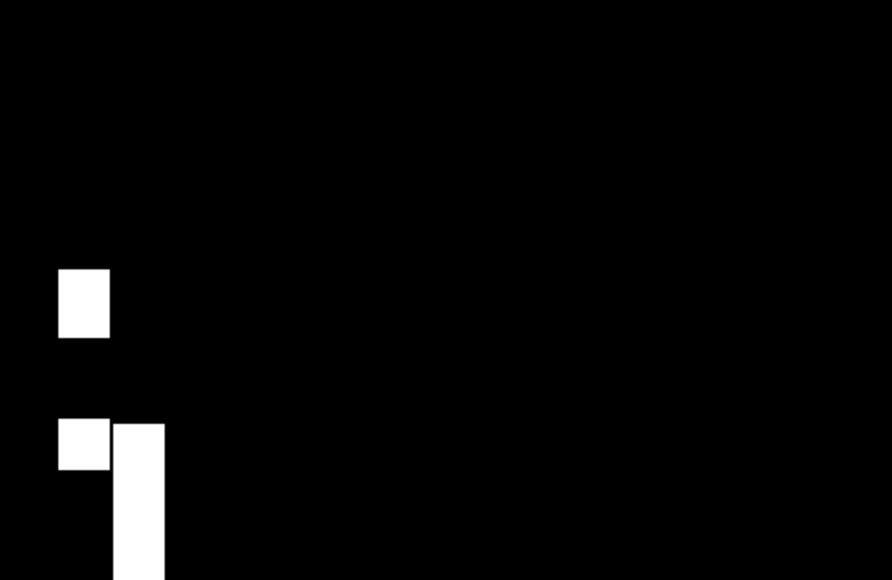

# Jumping Dinosaur Game with NEAT AI

A Pygame-based jumping dinosaur game where the dinosaur learns to jump over obstacles using a Neural Network with NEAT (NeuroEvolution of Augmenting Topologies) algorithm.

## Features

- **AI-Powered Dinosaur**: Uses a neural network to make jumping decisions
- **NEAT Evolution**: Implements NeuroEvolution of Augmenting Topologies for AI learning
- **Population Management**: Tracks multiple species and their performance
- **Real-time Learning**: AI evolves through generations to improve performance
- **Dynamic Obstacles**: Randomly generated block heights and positions

## How It Works

The dinosaur uses a neural network with 3 inputs:
- Distance to the nearest obstacle
- Height of the obstacle
- Current vertical position

The AI makes jumping decisions based on these inputs, and the population evolves over generations to improve performance.

## Files Structure

- `main.py` - Main game loop and NEAT implementation
- `Population.py` - Population management and evolution logic
- `DinoBrain.py` - Neural network implementation
- `Node.py` - Individual neuron implementation
- `Connection.py` - Neural network connections
- `component.py` - Game objects (Ground, Dino, Blocks)
- `config.py` - Game configuration and object instantiation

## Requirements

- Python 3.7+
- Pygame

## Installation

1. Clone the repository
2. Install pygame: `pip install pygame`
3. Run the game: `python3 main.py`

## How to Play

The game runs automatically - watch as the AI learns to jump over obstacles! The console will show generation progress and fitness scores.

## NEAT Features

- **Species Management**: Groups similar neural networks
- **Fitness Tracking**: Measures performance based on distance traveled
- **Mutation**: Randomly modifies neural network weights
- **Evolution**: Best performers breed to create next generation
